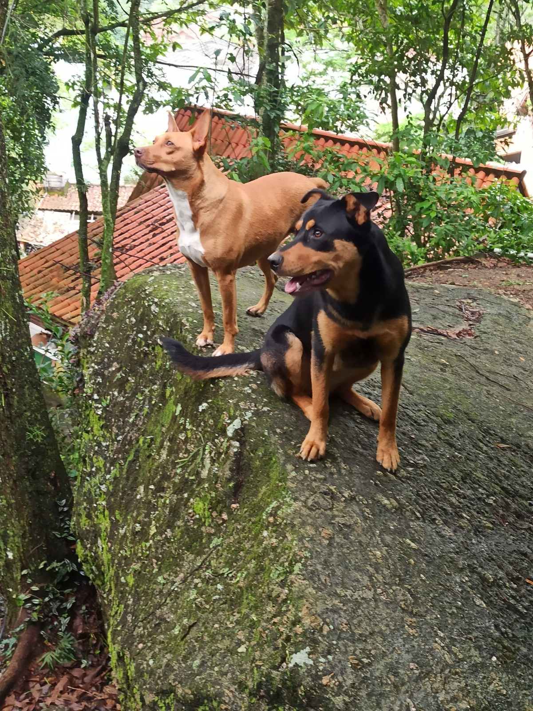
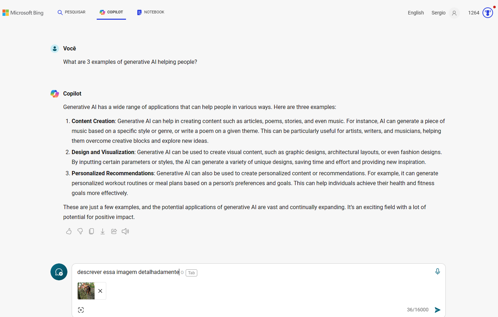
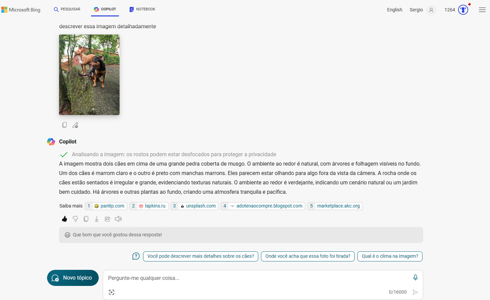
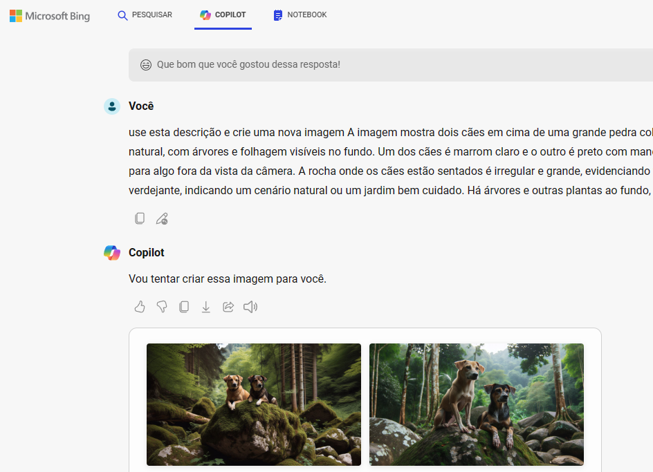
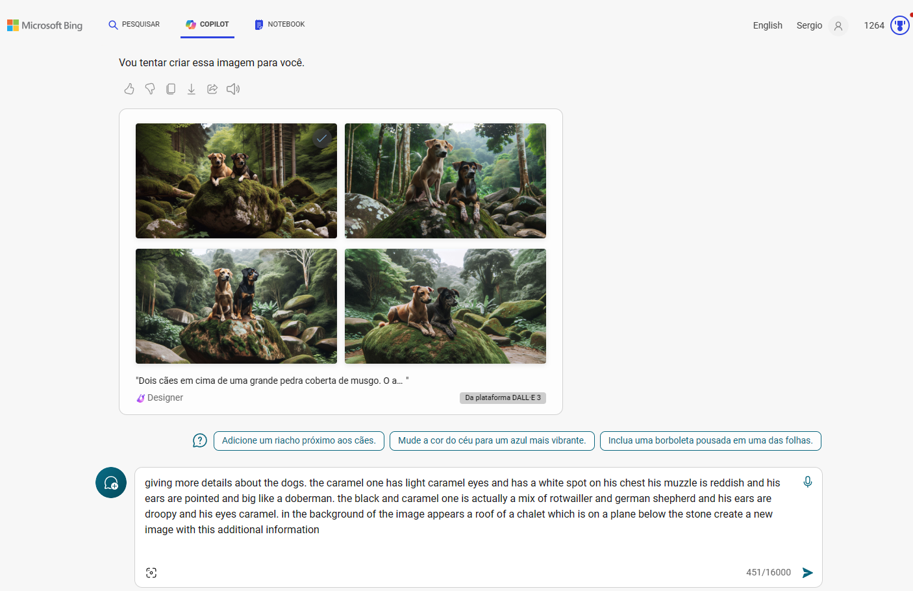
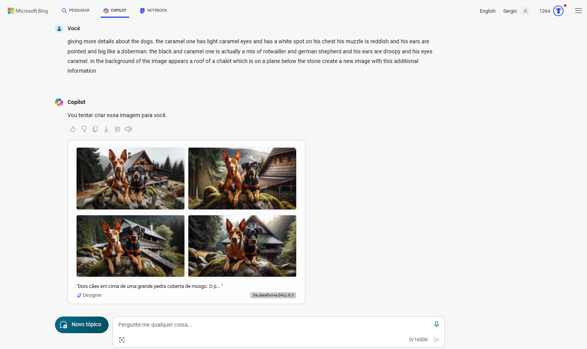
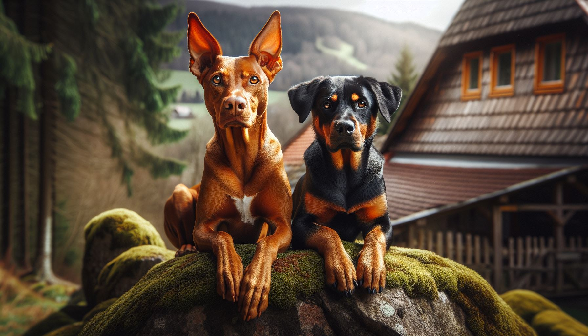

# criação de imagens com recurso de IA do copilot

**steps**

1. **imagem original das minhas duas cadelas** 
 
   

2. **imagem original - upload para o copilote e prompt** 

   

3. **resultado da descrição da imagem** 

      

4. **novo prompt para criação de uma nova imagem baseada na descrição** 

      

5. **resultado e novo prompt em inglês (boas práticas) para melhorar a imagem** 
 
      

6. **novo resultado** 
 
      

7. **resultado da imagem escolhida ao final do processo** 
    
      

**todas as imagens criadas estão disponíveis no projeto**